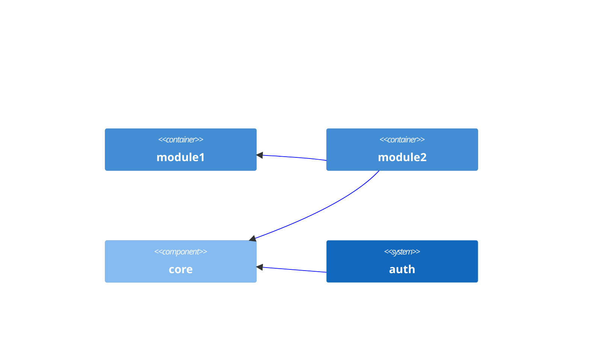

# shift-left-kotlin
Example of shift-left engineering practices in Kotlin       

### Build Overview

- 
- 
- 
- 

### Dependency Diagram

```mermaid
C4Context        
   UpdateLayoutConfig($c4ShapeInRow="3")                           
   Container(module1, "module1")
   Container(module2, "module2")
   Component(core, "core")
   System(auth, "auth")
   Rel(auth, core, " ") 
   UpdateRelStyle(auth, core, $lineColor="blue")
   Rel(module2, core, " ") 
   UpdateRelStyle(module2, core, $lineColor="blue")
   Rel(module2, module1, " ") 
   UpdateRelStyle(module2, module1, $lineColor="blue")                
```