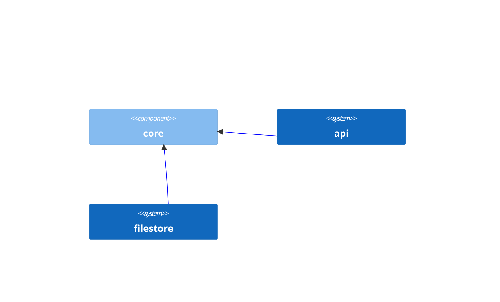

# shift-left-kotlin
Example of shift-left engineering practices in Kotlin       

## Build Overview

### Library

- 

### Service

- 
- 

## Dependency Diagram

```mermaid
C4Context        
   UpdateLayoutConfig($c4ShapeInRow="2")                           
   Component(core, "core")
   System(api, "api")
   System(filestore, "filestore")
   Rel(api, core, " ") 
   UpdateRelStyle(api, core, $lineColor="blue")
   Rel(filestore, core, " ") 
   UpdateRelStyle(filestore, core, $lineColor="blue")                
```