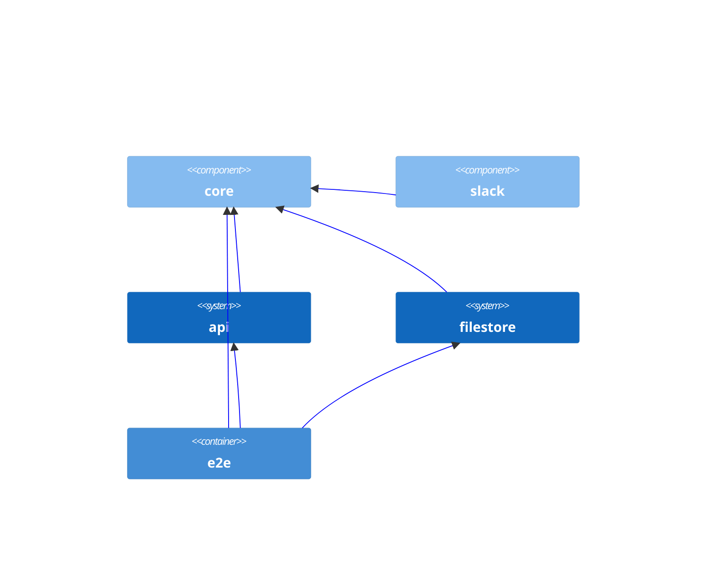

# shift-left-kotlin
Example of shift-left engineering practices in Kotlin       

## Build Overview

### Library

- [core](https://github.com/albertlatacz/shift-left-kotlin/tree/main/libraries/core) 
- [slack](https://github.com/albertlatacz/shift-left-kotlin/tree/main/libraries/slack) 

### Service

- [api](https://github.com/albertlatacz/shift-left-kotlin/tree/main/services/api) 
- [filestore](https://github.com/albertlatacz/shift-left-kotlin/tree/main/services/filestore) 

### Tests

- [e2e](https://github.com/albertlatacz/shift-left-kotlin/tree/main/tests/e2e) 

## Dependency Diagram

