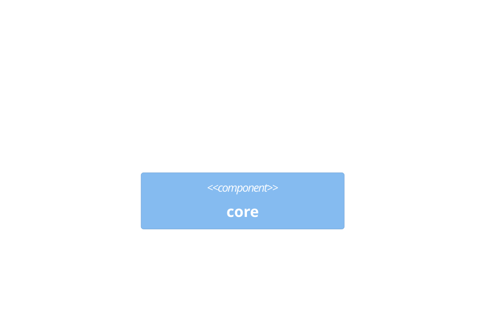

# core
        

## Ownership
This module is maintained by *TEAM1*

## Dependencies
none

## Dependency Diagram

```mermaid
C4Context        
   UpdateLayoutConfig($c4ShapeInRow="2")                           
   Component(core, "core")
                
```