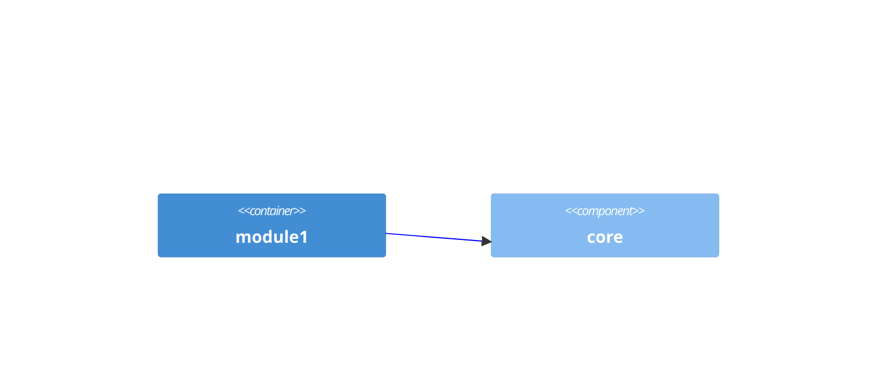

# module1
        

## Ownership
This module is maintained by *TEAM1*

## Dependencies
- [core](https://github.com/albertlatacz/shift-left-kotlin/tree/main/libraries/core)

## Dependency Diagram

```mermaid
C4Context        
   UpdateLayoutConfig($c4ShapeInRow="2")                           
   Container(module1, "module1")
   Component(core, "core")
   Rel(module1, core, " ") 
   UpdateRelStyle(module1, core, $lineColor="blue")                
```