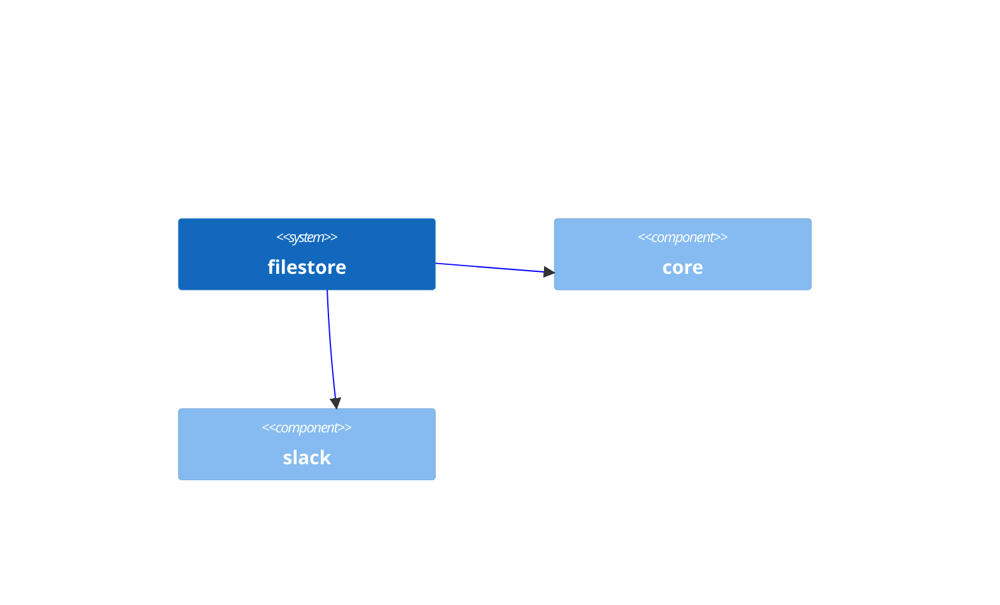

# filestore
        

## Ownership
This module is maintained by *TEAM1*

## Dependencies

### Library

- [core](https://github.com/albertlatacz/shift-left-kotlin/tree/main/libraries/core) 
- [slack](https://github.com/albertlatacz/shift-left-kotlin/tree/main/libraries/slack) 

## Dependency Diagram

