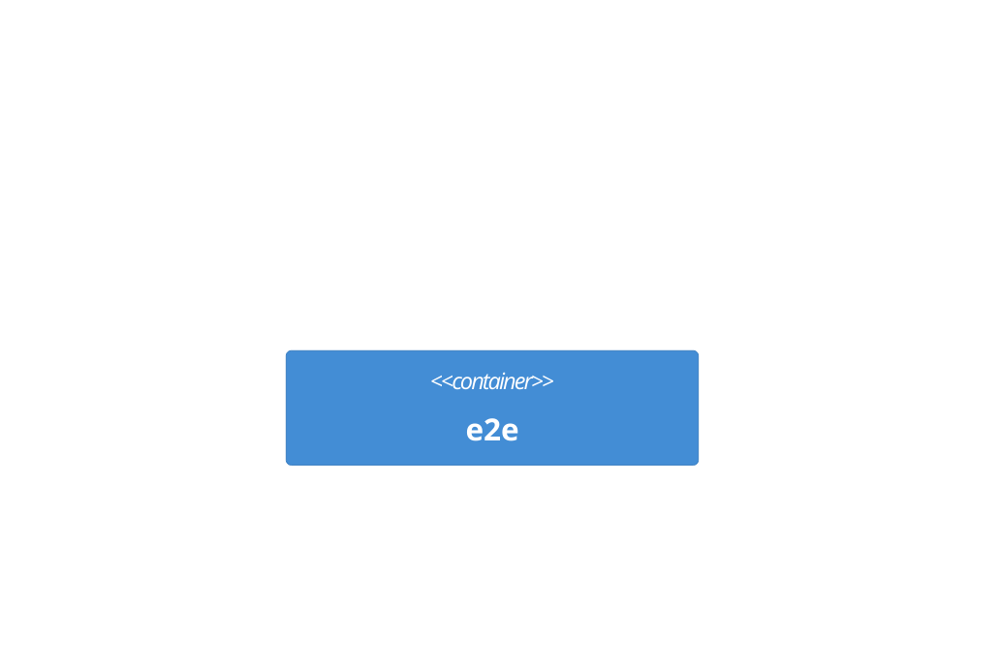

# e2e
        

## Ownership
This module is maintained by *TEAM1*

## Dependencies

none

## Dependency Diagram

```mermaid
C4Context        
   UpdateLayoutConfig($c4ShapeInRow="2")                           
   Container(e2e, "e2e")
                
```